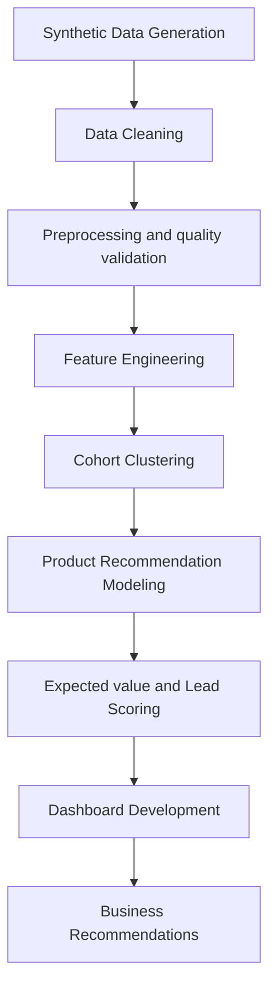

# B2B Cohort Analysis & Lead Generation
An end-to-end analytics and machine-learning project that transforms synthetic B2B sales and Salesforce activity data into customer cohorts, next-best-product recommendations, prioritized sales leads and an executive Power BI dashboard.


## Executive Summary
This project addresses a common B2B commercial analytics challenge: sales teams have substantial customer and transaction data but lack a repeatable way to identify which accounts to protect, develop, reactivate or approach with a specific cross-sell offer.

The solution combines customer behavior, product breadth, purchase recency, historical value and Salesforce engagement in a six-stage analytical pipeline:

1. Generate a realistic three-year synthetic B2B dataset.
2. Clean and validate sales, customer, product, and CRM activity tables.
3. Engineer customer-level behavioral, value, RFM, product and engagement features.
4. Segment purchasing customers into five interpretable commercial cohorts.
5. Train product-level propensity models and rank products not previously purchased.
6. Convert recommendations into a prioritized lead queue and Power BI reporting model.

## Business Context
The project represents a multi-country B2B company with 2000 customers, 180 products, several customer segments, a multi-level product hierarchy and sales and CRM activity spanning January 2023 through December 2025.

Commercial teams need to answer four connected questions:
- Which customer groups contribute the most value and require protection?
- Which customers show realistic cross-sell potential?
- Which product should be recommended to each customer next?
- Which opportunities should sales representatives work first?

The analytical output is designed for sales leadership, key account management, commercial operations and business intelligence teams. It supports prioritization and campaign design; it does not replace sales judgment or a validated revenue forecast.

## Problem Statement 
Traditional sales reporting explains what has already happened but rarely converts historical behavior into a practical action queue. A sales team reviewing thousands of customers and dozens of product categories cannot efficiently identify the strongest customer-product combinations manually.

The project therefore builds a decision-support system that:
- creates interpretable customer cohorts based on value, activity, recency, breadth and CRM engagement;
- estimates historical product affinity for every eligible customer-product combination;
- excludes product groups already purchased by the customer;
- ranks the three most relevant recommendations per customer;
- estimates a transparent order-value proxy for each recommendation;
- combines propensity, value, activity, Salesforce engagement and inactivity risk into a lead score; and
- exposes the result through an executive dashboard and a detailed priority queue.


## Dataset
The synthetic dataset is deterministic (`RANDOM_SEED = 42`) and contains deliberately embedded seasonality, customer behavior patterns, segment and industry preferences, missing values, and CRM engagement signals.

| Attribute | Scope |
| --- | ---: |
| Observation period | Jan 2023–Dec 2025 |
| Months | 36 |
| Customers | 2,000 |
| Customers with purchases | 1,993 |
| Products / SKUs | 180 |
| Product lines | 7 |
| Level-1 product groups | 6 |
| Level-2 product groups | 18 |
| Level-3 product groups | 35 |
| Sales rows | 68,723 |
| Salesforce activity rows | 39,508 |
| Customer segments | 5 |
| Industries | 10 |
| Countries | 8 |

Customer purchasing frequency and value vary by synthetic behavior type, segment, size, season, and product preference. The internal behavior type used during generation is removed from the public customer dimension and is not used directly as a model feature.

### Source Tables
| Table | Description |
|---|---|
| `df_fact_sales` | Transaction-level monthly sales data by customer and product|
| `df_dim_customer` | Customer dimension table with segment, size, industry, country and acquisition channel |
| `df_dim_product` | Product dimension table with product hierarchy and unit price|
| `df_fact_sf` | Salesforce activity table with activity count, selling time, activity type, sales rep and opportunity stage|

### Data Dictionary

## Data Quality Assessment
The project includes a structured data quality workflow before feature engineering and modeling. 
- Missing values identified and handled
- Duplicare records checked
- Customer and product ID consistency validated
- Invalid dates converted and reviewed
- Negative sales and unit values checked
- Data types standardized
- Product hierarchy cardinality reviewed
- Feature distributions reviewed before clustering

## Technology Stack
- Python
- pandas
- NumPy
- scikit-learn
- matplotlib
- Random Forest
- Logistic Regression
- Kmeans
- Agglomerative Clustering
- PCA
- Excel / openpyxl
- Power BI for dashboarding
- Jupyter Notebook for exploration

## Architecture

## Methodology

### Feature Engineering
Customer-level features were created across several categories: 
- Monetary features: total sales, historical LTV, average monthly revenu
- Frequency features: active months, purchase frequency per year
- Recency features: months since last purchase
- Product breadth features: distinct products and prducts group coverage
- Activity features: activity ratio, inactivity gap metrics
- Salesforce features: total events,active months, selling time, engagement indicators
- Product matrix features: binary purchase flags, purchase share matrices

### Cohort clustering
Numeric features are median-imputed and standardized; categorical value and recency segments are mode-imputed and one-hot encoded. Agglomerative Ward clustering and K-Means are compared for `k = 3…8` using Silhouette, Calinski-Harabasz, Davies-Bouldin and cluster-size diagnostics.

The final solution uses **Agglomerative Ward with five clusters**. Its Silhouette score is **0.10**, Calinski-Harabasz score is **133.60**, and Davies-Bouldin score is **2.14**. K-Means with three clusters achieves the best pure Silhouette score (**0.13**), but five Ward clusters are retained to provide the more actionable Power, Core, Emerging, Occasional, and Dormant business structure.

The first two PCA components explain approximately **25.8%** of transformed variance and are used only as a visual diagnostic, not as the clustering input.

### Product propensity modeling

One binary classifier is trained per product target: six Level-1 targets and 35 Level-3 targets. Targets with fewer than 25 positive customers would be skipped; all 41 supplied targets meet the support threshold.

For every target:
1. All target columns, customer IDs, date fields, and purchase-share fields are excluded from predictors.
2. Data is split into an 80% training and 20% stratified validation set.
3. Numeric features are median-imputed and standardized.
4. Categorical features are mode-imputed and one-hot encoded.
5. Balanced Logistic Regression and Balanced Random Forest are compared.
6. The model with the highest Average Precision, using ROC-AUC as a tie-breaker, is selected.
7. The selected pipeline is refitted on all available customers.
8. Customers who already purchased the target product group are excluded from its recommendation set.

### Expected order value

Because the data contains no order or invoice identifier, a customer-month-product-group combination acts as the closest available value event.

For each recommendation, the expected order value is based on a segment-product mean shrunk toward the product-wide mean:

```text
shrinkage_weight = segment_product_events / (segment_product_events + 30)

base_expected_value =
    shrinkage_weight × segment_product_mean
    + (1 - shrinkage_weight) × product_mean

expected_order_value =
    base_expected_value × customer_value_multiplier
```

The customer multiplier compares the customer's average event value with the median customer event value in the same segment and is capped between `0.50` and `2.00`. Product event values are winsorized at the 1st and 99th percentiles where at least 20 observations are available.

### Lead scoring and tiers

The transparent lead-scoring formula is:

```text
activity_score = 0.60 × recency_score + 0.40 × frequency_score

lead_score =
    0.45 × model_score
    + 0.25 × value_score
    + 0.20 × activity_score
    + 0.10 × Salesforce_engagement_score
    - 0.10 × inactivity_risk_penalty
```

All components are normalized to a `0–1` scale. The Top-3 recommendations are retained per customer. Recommendation tiers describe individual customer-product rows, while customer tiers use only each customer's Top-1 lead score:

- **Hot:** top 20%
- **Warm:** next 40%
- **Cold:** bottom 40%

This separation prevents a customer with many recommendations from being incorrectly classified as Hot simply because one of several recommendation rows falls in the top recommendation quantile.

## Dashboard
The reporting layer contains three decision-oriented pages with shared filters for year, cohort, segment, industry, and lead tier.

### Executive Overview
Provides a combined view of sales performance, customer mix, cohort contribution, product-group sales, lead-pipeline value, and four executive priorities: protect Core and Power, convert Hot opportunities, scale Emerging accounts and selectively reactivate Dormant customers.


#### Cohort Performance
Compares cohort size, activation, sales contribution, sales per active customer, activity ratio, and recency. A detailed cohort profile supports comparison between customer volume and commercial value.


#### Lead Generation
Shows recommendation coverage, customer lead-tier mix, propensity-weighted opportunity value, top recommended products, and a ranked priority queue with model probability, expected value, lead score, inactivity, cohort and key drivers.


## Results

### Model Performance

The notebook workflow produces model registry outputs for each product target. These include validation metrics and baseline comparisons.

| Model | Use Case | Main Metric | Purpose |
|---|---|---|---|
| Agglomerative Clustering | Customer cohort segmentation | Silhouette Score | Identify behavioral customer groups |
| KMeans | Alternative clustering benchmark | Silhouette Score | Compare cluster structure |
| Logistic Regression | Product recommendation | Average Precision | Interpretable classification baseline |
| Random Forest | Product recommendation | Average Precision | Nonlinear product recommendation model |

## Key Insights

1. Customer value and activity are not the same: some high-value customers show reduced recent activity and should be monitored for retention risk.

2. Product coverage varies significantly across customers, creating clear cross-sell opportunities.

3. Cohort-based segmentation makes lead prioritization more actionable than treating all customers equally.

4. Salesforce activity can reveal customers with commercial engagement but no recent sales, creating a useful follow-up pool.

5. A lead score is more useful than model probability alone because it combines predictive and business relevance.

## Business Recommendations

### Short-Term Actions
- Prioritize Hot LEads with high model probability and high customer value
- Use cohort labels to tailor sales messaging
- Target customers with recent Salesforce activity but no recent sales
- Create cross-sell campaigns for customers with los product coverage
- Review At-Risk / Dormant customers for reactivation campaigns

### Long-Term Actions
- Connect lead scoring outputs to CRM workflows
- Track conversion rated by lead tier and cohort
- Validate lead score weights using real sales outcomes
- Build a feedback loop between sales actions and model retraining 
- Expand the dashboard into an operatopnal sales monitoring tool

## Limitations
- The dataset is synthetic and does not represent a real company
- Recommendation targets are based on historical product ownership rather than true future purchase behavior
- External market factors are not included
- Lead score weights are business assumptions and should be validated with conversion data

## Future Improvements
- Use a time-based train/test split for recommendation modeling
- Predict next-period product purchase instead of historical product ownership
- add probability calibration
- Add SHAP or permutation importance for model explainability
- Add expected revenue or margin uplift to lead scoring
- Add SQL-based transformations for warehouse-style workflows

## Repository Structure
```text
lead-generation/
│
├── data/
│   ├── synthetic/
│   ├── processed/
│   ├── feature_engineering/
│   ├── cohort_clustering/
│   ├── product_recommendation/
│   └── dashboard_datasets/
│
├── notebooks/
│   ├── 00_generate_synthetic_dataset.py
│   ├── 01_preprocessing.ipynb
│   ├── 02_feature_engineering.ipynb
│   ├── 03_cohort_clustering.ipynb
│   ├── 04_product_recommendation_lead_generation.ipynb
│   └── 05_dashboard_datasets.ipynb
│
├── dashboard/
│   └── Lead Generation.pbix
│
├── images/
│   ├── 01_executive_overview.png
│   ├── 02_cohort_performance.png
│   └── 03_lead_generation.png
│
├── requirements.txt
└── README.md
```

## Installation
Clone the repository:
```bash
git clone https://github.com/AnastasiaSamoylova92/lead-generation.git
cd lead-generation
```
Install dependencies:
```bash
pip install -r requirements.txt
```
Run the notebooks in order:
```text
00_generate_synthetic_dataset.py
01_data_preprocessing_cleaning.ipynb
02_feature_engineering.ipynb
03_cohort_clustering.ipynb
04_product_recommendation_lead_generation.ipynb
05_dashboard_datasets.ipynb
```

## Author
Anastasia Samoylova
M.Sc. | BI & Data Analytics | ML

