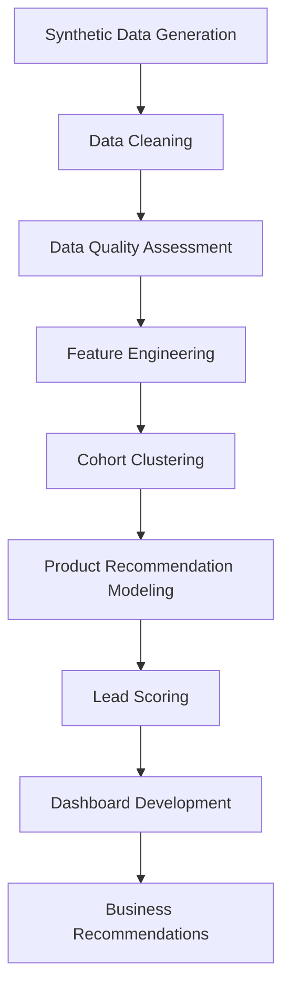
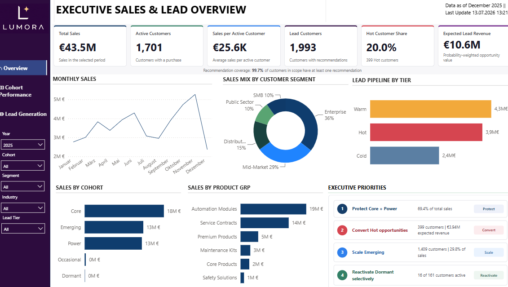
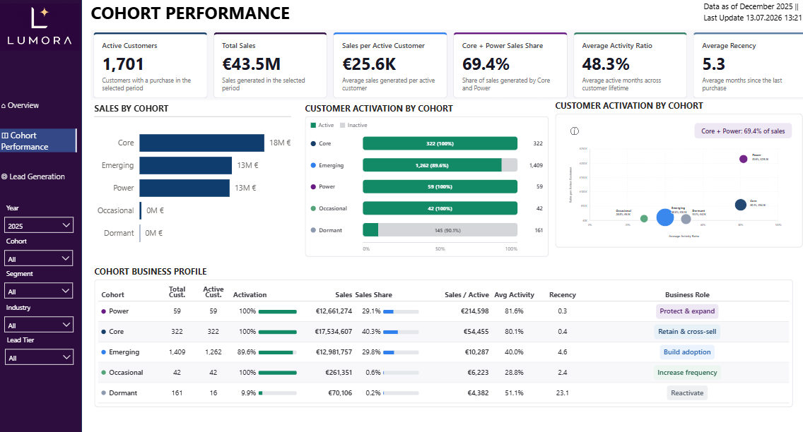
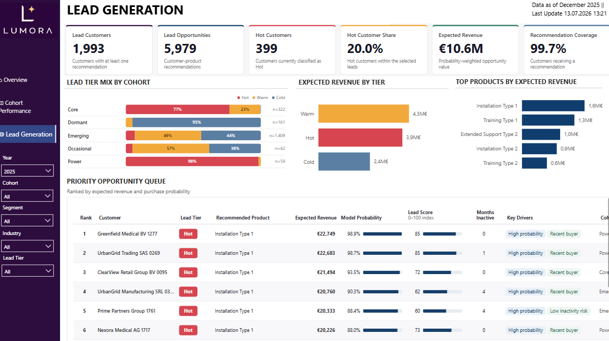

# B2B Cohort Analysis & Lead Generation
End-to-end B2B analytics project for customer cohort segmentation, product recommendation modeling, lead scoring and sales dashboarding.


## Executive Summary
This project simulates a realistic B2B sales environment and builds a complete analytics pipeline that transforms raw customer, product, sales, and Salesforce activity data into actionable sales intelligence. The final output enables sales teams to understand customer cohorts, identify cross-sell opportunities, prioritize leads, and monitor commercial performance through dashboard-ready outputs.

## Business Context

### Industry
THe project is based on a synthetic B2B company that sells industrial, safety, automation, maintenance, and service-related products to business customers across multiple European regions. 

### Business Challenge
B2B sales teams often manage large customer portfolios with limited time and incomplete visibility into customer behavior. Without a structured analytical approach, it is difficult to know: 
- whioch customers should be prioritized 
- which customers are at risk of inactivity
- which product categories are suitable for cross-sell
- which customer cohorts require different commercial actions

### Stakeholders
- Sales managers
- Account executives
- Customer success teams
- Marketing and campaign managers
- Business intelligence teams
- Commercial leadership

### Business Objectives
- Segment customers into meaningful behavioural cohorts
- Identify product recommendation opportunities
- Prioritize customers using a transparent lead score
- Provide dashboard visuals for executive and sales-team decision making
- Build a reproducible analytics workflow suitable for a portfolio 

## Problem Statement 
The business needs a data-driven way to priroitize sales outreach and recommend relevant product categories to cstomers. The challenge is to combine historical sales behavior, customer activity, product coverage, Salesforce engagement and customer value into a clear lead generation framework.

## Dataset
The dataset is fully synthetic and does not contain real customer data, personal data or confidential company data. It was generated to resemble a realistic B2B commercial dataset.

### Source Tables
| Table | Description |
|---|---|
| `df_fact_sales` | Transaction-level monthly sales data by customer and product|
| `df_dim_customer` | Customer dimension table with segment, size, industry, country and acquisition channel |
| `df_dim_product` | Product dimension table with product hierarchy and unit price|
| `df_fact_sf` | Salesforce activity table with activity count, selling time, activity type, sales rep and opportunity stage|

### Data Dictionary

## Data Quality Assessment
The project includes a structured data quality workflow before feature engineering and modeling. 
- Missing values identified and handled
- Duplicare records checked
- Customer and product ID consistency validated
- Invalid dates converted and reviewed
- Negative sales and unit values checked
- Data types standardized
- Product hierarchy cardinality reviewed
- Feature distributions reviewed before clustering

## Technology Stack
- Python
- pandas
- NumPy
- scikit-learn
- matplotlib
- Random Forest
- Logistic Regression
- Kmeans
- Agglomerative Clustering
- PCA
- Excel / openpyxl
- Power BI for dashboarding
- Jupyter Notebook for exploration

## Architecture

## Methodology

### Feature Engineering
Customer-level features were created across several categories: 
- Monetary features: total sales, historical LTV, average monthly revenu
- Frequency features: active months, purchase frequency per year
- Recency features: months since last purchase
- Product breadth features: distinct products and prducts group coverage
- Activity features: activity ratio, inactivity gap metrics
- Salesforce features: total events,active months, selling time, engagement indicators
- Product matrix features: binary purchase flags, purchase share matrices

### Model Development
The project includes 2 modeling layers: 
- Cohort clustering for customer segmentation
- Product recommendation models for lead generation

Models used: 
- Agglomerative Clustering
- KMeans
- Logistic Regression
- Random Forest

### Evaluation
Clustering was evaluated using:
- Silhouette Score
- Calinsiki-Harabasz Score
- Davies-Bouldin Score
- Business interpretability of clusters

Recommendation models were evaluated using: 
- Average Precision
- ROC-AUC
- Precision at threshold
- Recall at threshold
- Popularity baseline comparison

## Dashboard
The dashboard concept enables stakeholders to:
- Monitor sales KPIs
- Analyze customer cohorts
- Review product group performance
- Track lead tier distribution
- Identify high-prioritay leasd opportunities
- Monitor sales activiation gaps

### Dashboard Screenshots

#### Executive Overview


#### Cohort Performance


#### Lead Generation


## Results

### Model Performance

The notebook workflow produces model registry outputs for each product target. These include validation metrics and baseline comparisons.

| Model | Use Case | Main Metric | Purpose |
|---|---|---|---|
| Agglomerative Clustering | Customer cohort segmentation | Silhouette Score | Identify behavioral customer groups |
| KMeans | Alternative clustering benchmark | Silhouette Score | Compare cluster structure |
| Logistic Regression | Product recommendation | Average Precision | Interpretable classification baseline |
| Random Forest | Product recommendation | Average Precision | Nonlinear product recommendation model |

## Key Insights

1. Customer value and activity are not the same: some high-value customers show reduced recent activity and should be monitored for retention risk.

2. Product coverage varies significantly across customers, creating clear cross-sell opportunities.

3. Cohort-based segmentation makes lead prioritization more actionable than treating all customers equally.

4. Salesforce activity can reveal customers with commercial engagement but no recent sales, creating a useful follow-up pool.

5. A lead score is more useful than model probability alone because it combines predictive and business relevance.

## Business Recommendations

### Short-Term Actions
- Prioritize Hot LEads with high model probability and high customer value
- Use cohort labels to tailor sales messaging
- Target customers with recent Salesforce activity but no recent sales
- Create cross-sell campaigns for customers with los product coverage
- Review At-Risk / Dormant customers for reactivation campaigns

### Long-Term Actions
- Connect lead scoring outputs to CRM workflows
- Track conversion rated by lead tier and cohort
- Validate lead score weights using real sales outcomes
- Build a feedback loop between sales actions and model retraining 
- Expand the dashboard into an operatopnal sales monitoring tool

## Limitations
- The dataset is synthetic and does not represent a real company
- Recommendation targets are based on historical product ownership rather than true future purchase behavior
- External market factors are not included
- Lead score weights are business assumptions and should be validated with conversion data

## Future Improvements
- Use a time-based train/test split for recommendation modeling
- Predict next-period product purchase instead of historical product ownership
- add probability calibration
- Add SHAP or permutation importance for model explainability
- Add expected revenue or margin uplift to lead scoring
- Add SQL-based transformations for warehouse-style workflows

## Repository Structure
```text
lead-generation/
│
├── data/
│   ├── synthetic/
│   ├── processed/
│   ├── feature_engineering/
│   ├── cohort_clustering/
│   ├── product_recommendation/
│   └── dashboard_datasets/
│
├── notebooks/
│   ├── 00_generate_synthetic_dataset.py
│   ├── 01_preprocessing.ipynb
│   ├── 02_feature_engineering.ipynb
│   ├── 03_cohort_clustering.ipynb
│   ├── 04_product_recommendation_lead_generation.ipynb
│   └── 05_dashboard_datasets.ipynb
│
├── dashboard/
│   └── Lead Generation.pbix
│
├── images/
│   ├── 01_executive_overview.png
│   ├── 02_cohort_performance.png
│   └── 03_lead_generation.png
│
├── requirements.txt
└── README.md
```

## Installation
Clone the repository:
```bash
git clone https://github.com/AnastasiaSamoylova92/lead-generation.git
cd lead-generation
```
Install dependencies:
```bash
pip install -r requirements.txt
```
Run the notebooks in order:
```text
00_generate_synthetic_dataset.py
01_data_preprocessing_cleaning.ipynb
02_feature_engineering.ipynb
03_cohort_clustering.ipynb
04_product_recommendation_lead_generation.ipynb
05_dashboard_datasets.ipynb
```

## Author
Anastasia Samoylova
M.Sc. | BI & Data Analytics | ML

